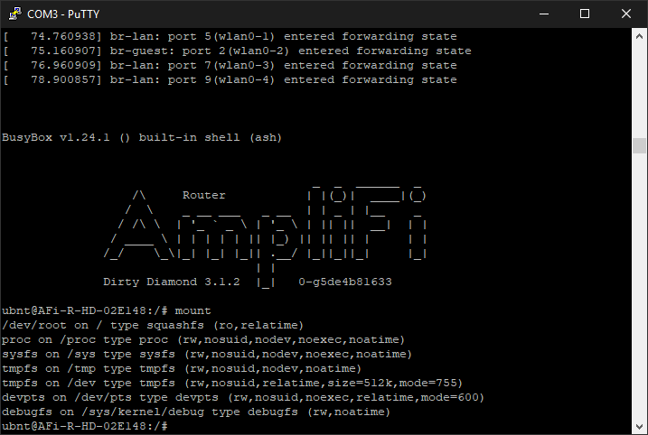
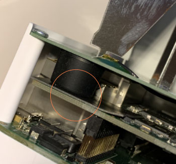
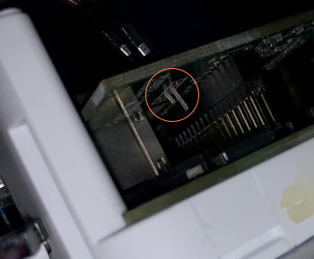
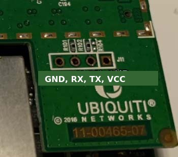
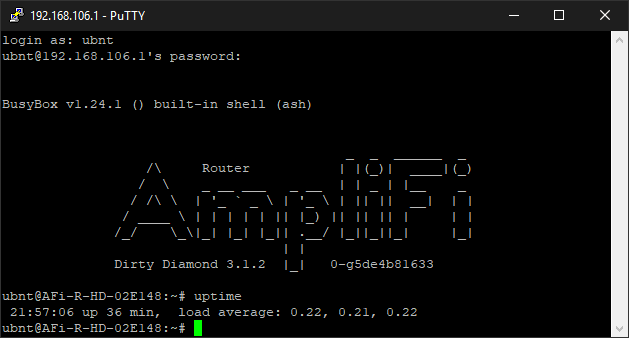
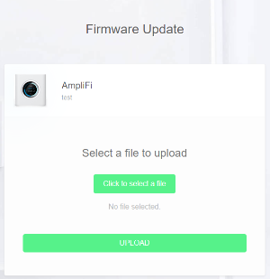
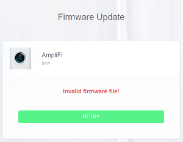
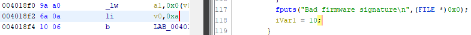
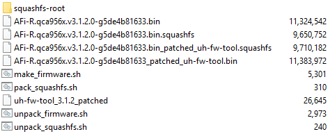

# Jailbreaking the AFi-R

This guide covers gaining full access to the AmpliFi AFi-R router: serial console access, enabling SSH, and flashing custom firmware.

> **Warning:** Modifying your router can brick it and/or void your warranty. You're doing this at your own risk.

## Serial console

To get access to the router's administrative serial console, connect a UART reader to the J11 header on the main board.

### UART headers

There are five 4-pin UART headers on the router's boards. Four sit on the main SoC board.

Do **NOT** connect VCC to your UART reader. It's recommended to connect GND to the shield of your router's power connector rather than to the header's GND.

|                |Pinout                                     |Baudrate |Purpose                             |
|----------------|-------------------------------------------|---------|------------------------------------|
|J8              |`unk 0.0V, unk 0.0V, unk 3.3V, unconnected`|         |Not analyzed                        |
|J9              |`unk 3.3V, unk 0.0V, unk 3.3V, unk 0.0V`   |         |Not analyzed                        |
|J10             |`unk 0.0V, unk 3.3V, unk 3.3V, unk 3.3V`   |         |Not analyzed                        |
|J11             |`GND, RX, TX, VCC 3.3V`                    |115200   |Main SoC's serial console           |
|J29             |`unk 3.3V, unk 0.0V, unk 0.0V, unk 0.0V`   |         |Not analyzed                        |

### J11

The UART header labeled J11 can be used for administrative communication with the main SoC. Connect a UART reader to the RX, TX and GND pins.

The router uses a simple BusyBox `/bin/ash` shell without authentication.



A dump from J11's boot procedure and a run of the `mount` command can be found [here](../bootlog.txt).

### Finding J11

You can find a teardown of the router [here](https://fccid.io/SWX-AFR/Internal-Photos/Internal-Photos-3028132).

The J11 header is on the bottom right corner of the middle board.

From above, J11 is obstructed by a rubber piece stuck to the top board:



But the header is also exposed from the underside:



Pinout for J11 as seen from above:



## Enabling developer mode (SSH access)



Developer mode enables the Dropbear SSH server and other features.

1. Connect to the serial console through J11.
2. Run `echo 'SSH' | prst_tool -w misc` and then `reboot`.

After rebooting:

* **SSH access** on port 22 — login with username `ubnt` and your admin password.
  * Modern OpenSSH clients (8.8+) disable `ssh-rsa` by default. Add to `~/.ssh/config`:
    ```
    Host amplifi amplifi.lan
        Hostname amplifi.lan
        User ubnt
        IdentityFile ~/.ssh/id_rsa_amplifi
        HostKeyAlgorithms +ssh-rsa
        PubkeyAcceptedAlgorithms +ssh-rsa
    ```
  * Set up key-based auth (no password prompt):
    ```bash
    ssh-keygen -t rsa -b 2048 -f ~/.ssh/id_rsa_amplifi -N ""
    cat ~/.ssh/id_rsa_amplifi.pub | ssh amplifi 'cat >> /etc/dropbear/authorized_keys'
    ```
  * Then simply: `ssh amplifi`
  * **Note:** Dropbear on this firmware only supports RSA keys (not ed25519).
  * **Note:** `/etc/dropbear` is symlinked to `/tmp/persist/etc/dropbear`, which is loaded from flash at boot via `cfg_tool`. However, only files listed in `/etc/persist_list` are saved — and `authorized_keys` is not in that list. To persist SSH keys, add the entry to the persist list in a custom firmware build (see below).
* `http://amplifi.lan/info.php` — system information, connected clients, diagnostics
* `http://amplifi.lan/qos.php` — custom QoS rules
* `http://amplifi.lan/speedtest.php` — download/upload speed tests

## Firmware

### Downloading firmware

You can find the firmware link for the latest version either by:
* Visiting Ubiquiti's forum, for example https://community.ui.com/releases/AmpliFi-Firmware-HD-and-Instant-4-0-0/b18104b6-554a-490b-8243-ad72ec066a49
* Or visiting https://www.ubnt.com/update/amplifi/check/?c=stable&t=AFi-R&v=3.4.3

### Flashing stock firmware

Flashing a firmware file on-demand can be done at `http://amplifi.lan/fwupdate.php`.



The web server runs `uh-fw-tool` to verify the firmware. This tool rejects firmware that is invalid, unsigned, or not signed by the manufacturer.



### Custom firmware

#### Patching uh-fw-tool

`uh-fw-tool` (at `/sbin/uh-fw-tool`) verifies and flashes firmware. Out of the box, it only accepts manufacturer-signed firmware, but this can be bypassed.

Patch it to return 0 instead of 0xa when the signature is "bad":

1. Open in Ghidra or IDA and search for "Bad firmware signature"
2. Patch the local variable assignment from `0xa` to `0x0`
3. Alternatively, search for the hex pattern `9A A0 6A 0A 10 06 B2 0C`* and replace `0A` with `00`



\*Tested on firmware versions 2.0.0, 2.1.1, 2.6.1, 3.1.2, and 3.3.0.

#### Building custom firmware

Tools for extracting, modifying, and repacking firmware are available in [tools/](../tools/).



#### Flashing custom firmware

1. Connect to the serial console through J11.
2. Upload your patched `uh-fw-tool` through `http://amplifi.lan/fwupdate.php`:
   ```
   mv /tmp/uploaded-firmware.bin /tmp/uh-fw-tool_patched
   chmod u+x /tmp/uh-fw-tool_patched
   ```
3. Upload your custom firmware through `http://amplifi.lan/fwupdate.php`.
4. Flash it:
   ```
   /tmp/uh-fw-tool_patched -cf /tmp/uploaded-firmware.bin
   ```
5. Reboot: `reboot`

**Tip:** If you include the patched `uh-fw-tool` at `/sbin/uh-fw-tool` in your custom firmware, the web interface will accept custom firmware directly — no serial console needed for future flashes.

#### Persisting SSH keys across reboots

The router uses a persist system: `/etc/dropbear` is symlinked to `/tmp/persist/etc/dropbear`, which is saved to flash via `cfg_tool`. Only files in `/etc/persist_list` are saved, and `authorized_keys` is not included by default.

To make SSH keys persist, add the entry to the persist list in a custom firmware build:

```bash
# In your firmware output directory (with squashfs-root/ extracted):

# Add authorized_keys to the persist list so it survives reboots
echo '/etc/dropbear/authorized_keys' >> squashfs-root/etc/persist_list

# Extract the default config, add your key, repack
rm -rf /tmp/default_cfg
mkdir -p /tmp/default_cfg
tar xzf squashfs-root/etc/default.tar.gz -C /tmp/default_cfg
cat ~/.ssh/id_rsa_amplifi.pub >> /tmp/default_cfg/etc/dropbear/authorized_keys
tar czf squashfs-root/etc/default.tar.gz -C /tmp/default_cfg .
rm -rf /tmp/default_cfg

# Repack and flash
sudo bash tools/pack_squashfs.sh custom.squashfs
bash tools/make_firmware.sh AFi-R_v4.0.3.bin custom.squashfs AFi-R_v4.0.3_custom.bin
```

After flashing, the key will survive reboots. You can also update the key at runtime and save with:
```bash
# On the router:
. /lib/functions/afi-cfg-spipart.sh; cfg_write
```
