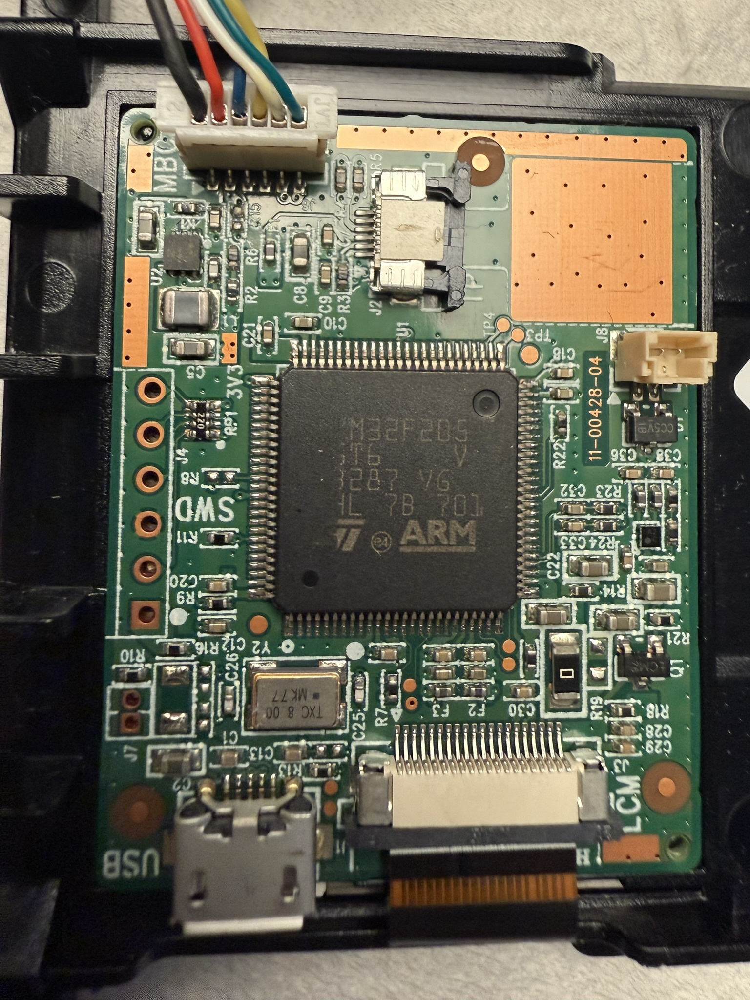

# AmpliFi AFi-R Display System — Reverse Engineering Report

Reverse engineered from firmware v4.0.3 (`squashfs-root/`). For custom firmware that lets you push arbitrary images to the display, see [custom_display_fw/](../custom_display_fw/).

## Table of Contents
1. [Hardware Architecture](#1-hardware-architecture)
2. [Kernel Driver Stack](#2-kernel-driver-stack)
3. [Software Architecture](#3-software-architecture)
4. [uictld — UI Control Daemon](#4-uictld--ui-control-daemon)
5. [Host - MCU Serial Protocol](#5-host---mcu-serial-protocol)
6. [libafixui.so — UI Rendering Library](#6-libafixuiso--ui-rendering-library)
7. [LCD MCU Firmware Upgrade Flow](#7-lcd-mcu-firmware-upgrade-flow)
8. [Integration Points](#8-integration-points)
9. [Display on MCU Side](#9-display-on-mcu-side)
10. [Summary](#10-summary)

## 1. Hardware Architecture

### Display Module
The AFi-R has a **physically separate LCD display board** connected to the main router board via **micro-USB**. This is a two-processor architecture:

| Component | Detail |
|---|---|
| **Main SoC** | Qualcomm Atheros QCA956X (MIPS 74Kc, 775 MHz) — runs Linux/OpenWrt |
| **Display MCU** | **STM32F205VGT6** (ARM Cortex-M3, LQFP100, 1MB flash, 128KB SRAM) |
| **HSE Crystal** | **8.00 MHz** (TXC brand, confirmed from board inspection) |
| **LCD Panel** | 240x240 ILI9341V or ST7789V — driven via FSMC 8080 parallel from the STM32 |
| **Touch Controller** | Cypress TrueTouch Gen5 (cyttsp5) — connected via I2C to the STM32 |
| **Communication** | USB CDC ACM (virtual serial port) — `/dev/ttyACM0` |
| **Board P/N** | 11-00428-04 (Ubiquiti), also labeled 444G0 |

### Display Board Photo



### Display Board Connectors

| Connector | Purpose |
|---|---|
| **Micro-USB** | Communication with main router board (USB CDC serial) |
| **SWD** | 6-pin SWD debug/programming header (pin 1 marked with rectangle = VCC 3.3V) |
| **J7** | 2-pin **BOOT0 jumper** — short both pads to enter STM32 ROM DFU bootloader |
| **LCM** | FFC connector to LCD panel (bottom right, FSMC 8080 parallel) |
| **J2** | Touch panel / I2C connector (top right) |
| **J4** | Additional connector (right side) |
| **J8** | Speaker connector (DAC CH2 via amplifier) |
| **J28** (on router mainboard) | 6-pin header carrying USB signals + power to the display board. Can be hot-plugged while router is on. |

### Display Panel Details
- **Resolution:** 240x240 pixels
- **Color depth:** RGB565 (16-bit, 65K colors)
- **Interface:** 8-bit 8080 parallel via STM32 FSMC (NOT SPI as the host-side driver name suggests)
- **FSMC mapping:** Command register at `0x60000000`, Data register at `0x60020000` (A16 selects D/C)
- **Controllers:** Dual support — ILI9341V (config 0) or ST7789V (config 1), selected at runtime via flag at RAM `0x20000EA8`
- **LCD driver vtable** in RAM at `[0x20002484]` with function pointers for read/write/dimensions

### USB Product IDs
- `0483:5740` — Normal operation (CDC ACM virtual serial port, STMicroelectronics VID)
- `0483:df11` — STM32 ROM DFU bootloader (activated by shorting J7 BOOT0 jumper)
- `1f9b:0` — Alternate LCD module detection (checked by uictld)

For PLL/clock configuration and DFU recovery instructions, see [custom_display_fw/](../custom_display_fw/).

### Display MCU Firmware
| File | Size | Purpose | Version String |
|---|---|---|---|
| `lib/firmware/AFi-R_LCD.bin` | 896 KB | Application firmware | `aFiDsp.AP.03.75` |
| `lib/firmware/AFi-R_LCD_BL.bin` | 64 KB | Bootloader firmware | `aFiDsp.LD.01.32` |
| `lib/firmware/cyttsp5_fw.bin` | 58 KB | Touch controller firmware | — |

The MCU firmware is ARM Cortex-M with:
- Initial SP: `0x2001FFCF` (128 KB SRAM)
- Reset vector: `0x08021578` (in Flash, offset past bootloader)
- Bootloader at `0x0800xxxx`, app at `0x08020000+`

---

## 2. Kernel Driver Stack

Module loading order (from `/etc/modules.d/`):

```
02-afi-leds       → afi_leds.ko          (LED ring)
06-fb             → fb.ko                (framebuffer core)
07-fb-sys-*       → sysfillrect/syscopyarea/sysimgblt/fb_sys_fops.ko
08-afi-sp8120fb   → sp8120fb.ko          (Visionox SPI framebuffer)
backlight         → video.ko, backlight.ko
input-cyttsp5     → cyttsp5.ko, cyttsp5_i2c.ko, cyttsp5_loader.ko
60-input-evdev    → evdev.ko
```

### sp8120fb.ko
- SPI-connected framebuffer driver (device tree compatible: `visionox,sp8120fb`)
- **Module is loaded but NO SPI device is bound** — verified via sysfs:
  - `/sys/bus/spi/drivers/visionox,sp8120fb` exists (driver registered)
  - No `/sys/class/graphics/fb0` exists (no device instance)
  - No `/sys/class/backlight/sp8120fb0/brightness` exists
- The main SoC has **no direct SPI connection to the LCD panel** — the only physical connection to the display board is USB
- **Writing to `/dev/fb0` has no effect** on the display (confirmed via testing)
- The `libafixui.so` framebuffer code path (fbdev_init, fbdev_flush) is unused in this hardware configuration

### cdc-acm.ko
- Standard USB ACM driver, creates `/dev/ttyACM0` for host-MCU serial communication
- This is the **sole communication path** between the main SoC and the display

---

## 3. Software Architecture

```
┌─────────────────────────────────────────────────────────┐
│                    Main SoC (MIPS)                      │
│                                                         │
│  ┌──────────┐    ubus IPC    ┌──────────────────────┐   │
│  │ ajconfd  │◄──────────────►│      uictld          │   │
│  │ dnsmasq  │                │  (UI Control Daemon) │   │
│  │ bleproto │                │                      │   │
│  │ firewall │                │                      │   │
│  │ hotplug  │                │                      │   │
│  └──────────┘                └──────────┬───────────┘   │
│                                         │               │
│                                  /dev/ttyACM0           │
│                                         │               │
│                                   cdc-acm.ko            │
│                                   (USB serial)          │
└─────────────────────────────────┬───────────────────────┘
                                  │ USB (sole connection)
                                  ▼
┌─────────────────────────────────────────────────────────┐
│               LCD Display Board (STM32F2xx)             │
│                                                         │
│  AFi-R_LCD_BL.bin (bootloader, 64KB @ 0x08000000)       │
│  AFi-R_LCD.bin    (application, 896KB @ 0x08020000)     │
│                                                         │
│  ┌──────────┐   ┌───────────────┐   ┌────────────────┐  │
│  │ USB CDC  │   │ FSMC 8080 par │   │ I2C → cyttsp5  │  │
│  │ (comms)  │   │ → ILI9341V /  │   │ (touch input)  │  │
│  │          │   │   ST7789V LCD │   │                │  │
│  └──────────┘   └───────────────┘   └────────────────┘  │
└─────────────────────────────────────────────────────────┘

Note: sp8120fb.ko is loaded on the host but has NO bound SPI device.
The host has no direct path to the LCD. ALL display control goes
through the MCU via USB CDC serial.
```

---

## 4. uictld — UI Control Daemon

**Binary:** `/usr/bin/uictld` (MIPS32, dynamically linked, musl libc)

**Init:** Starts at boot priority 13 via procd with auto-respawn (3600s window, 5s delay). Run with `-f` (foreground).

### Linked Libraries
- `libafixui.so` — UI rendering (LittlevGL + custom Xui C++ framework)
- `libubus.so` — OpenWrt IPC bus
- `libuci.so` — OpenWrt configuration
- `libjson-c.so.5` — JSON parsing
- `libblobmsg_json.so` — ubus message encoding
- `libiwinfo.so` — wireless info
- `libsw.so` — switch library (port states)
- `libuhsys.so` — Ubiquiti system library
- `liba.so` — Ubiquiti utility library

### UCI Configuration Keys
From `uictld.@uictld[0]`:

| Key | Purpose |
|---|---|
| `lcd_backlight` | Backlight brightness level |
| `lcd_backlight_timeout` | Screen timeout/sleep delay |
| `lcd_clock_type` | Clock display format |
| `lcd_test` | Enable test mode |
| `led` | LED brightness |
| `night_mode` | Night mode on/off |
| `night_start` | Night mode start hour |
| `night_end` | Night mode end hour |
| `snd_sys` | System sound enabled |
| `snd_tap` | Tap sound enabled |
| `snd_volume` | Sound volume |
| `adoption_filter` | Adoption RSSI filtering |
| `adoption_min_rssi` | Min RSSI for adoption |

### ubus Interface

**Object:** `uictld`

**Methods:**

| Method | Arguments | Purpose |
|---|---|---|
| `lcd` | See below | Send display commands |
| `force-inetcheck` | — | Force internet connectivity check |
| `pause-inetcheck` | `{"timeout": N}` | Pause inet check N seconds |
| `upgrade` | — | Enter upgrade mode on display |
| `reboot` | — | Reboot display MCU |
| `get-params` | — | Get current display parameters |
| `get-adoption-cache` | — | Get cached adoption info |
| `set-params` | `snd_sys`, `snd_tap`, `snd_volume`, `led`, `lcd_backlight`, `clock_type`, `lcd_backlight_timeout`, `night_mode`, `night_start`, `night_end` (all Integer) | Set display/sound parameters |
| `locate` | `{"timeout": N}` | Enter locate mode (pulsing) |
| `cfg` | `{"state": "string"}` | Set configuration state |
| `wifi` | `{"state": N, "rssi": N, "uplink": "string"}` | WiFi state update |
| `button-pressed` | — | Simulate button press |
| `button-released` | — | Simulate button release |
| `wps-start` | — | Start WPS |
| `wps-cancel` | — | Cancel WPS |
| `wps-done` | — | End WPS |

**`lcd` method arguments:**
`sta-count` (Int), `eth-count` (Int), `timezone` (String), `guest-timeout` (Int), `guest-remaining` (Int), `guest-count` (Int), `mp-pause` (Int), `inet-pause` (Int), `paused-devices` (Int), `test-cmd` (String), `wifi-proto-clients` (Table), `wifi-proto-client-removed` (Table), `update-avail` (Table), `port-up` (Int), `port-down` (Int), `wps-enabled` (Int), `teleport-pairing` (Table), `powerbox` (Table), `turbo-mode` (Boolean), `qos-enabled` (Boolean), `wan-bridge-mode` (Boolean)

**Events listened for:**
- `ubus.object.add` / `ubus.object.remove`
- Switch port hotplug events
- Configuration state changes
- Firmware update notifications

---

## 5. Host - MCU Serial Protocol

Communication over `/dev/ttyACM0` uses a text-based message protocol with `\r\n` line termination. Messages are prefixed with `hostmsg=` (host to MCU) or parsed as JSON (MCU to host).

### Two-Level Command Architecture

The MCU firmware has two separate command parsing layers:

**Layer 1 — CDC-level prefix check** (checked first, in order):
1. `debugmsg` — debug output control
2. `usbcdcreattach` — USB CDC reconnect
3. `watchdog=` — watchdog control
4. `mcutemp` — temperature sensor
5. `hostmsg=` — main display state protocol (JSON payload)

**Layer 2 — Dispatch table** (checked only if Layer 1 doesn't match):

16-entry table at flash `0x080A1A94` (string pointers) and `0x080A1AD4` (function pointers):

| # | Command | Purpose |
|---|---|---|
| 0 | `blversion` | Bootloader version |
| 1 | `listcmd` | List all commands |
| 2 | `reboot` | Reboot MCU |
| 3 | `blreboot` | Reboot into bootloader |
| 4 | `echo=` | Echo input (debug) |
| 5 | `mode` | Current mode (APP/LOADER) |
| 6 | `status` | Status code |
| 7 | `fwversion` | Firmware version |
| 8 | `fwbuildtime` | Build timestamp |
| 9 | `blhash=` | Set bootloader hash |
| 10 | `fwhash=` | Set firmware hash (for updates) |
| 11 | `mem=0x` | Read memory (Flash/RAM only) |
| 12 | `storedfwhash` | Get stored firmware hash |
| 13 | `psustatus` | Power supply status |
| 14 | `lcdsettings` | LCD controller info (ILI9341V/ST7789V) |
| 15 | `tpstatus` | Touch panel status |

Additional commands registered at runtime (not in flash table):
`audiotest=`, `hwtestall`

**Note:** Direct serial access to the dispatch table commands (via `dd of=/dev/ttyACM0`) can be unreliable due to Linux `cdc_acm` driver buffering. The `ubus call uictld ...` interface is the recommended way to control the stock display.

### Host to MCU Messages

```
hostmsg={"host_state": "booting"}
hostmsg={"host_state": "ready"}
hostmsg={"host_state": "<state>"}
hostmsg={"inet_status": "<color>","ip": "<wan_ip>","ip_lan": "<lan_ip>","ipv6": "<y/n>","sta_count": N,"eth_count": N,"paused_count": "N"}
hostmsg={"port_1": "0/1","port_2": "0/1","port_3": "0/1","port_4": "0/1","port_w": "u/d"}
hostmsg={"setup_ssid": "<ssid>"}
hostmsg={"throughput_tx": N,"throughput_rx": N}
hostmsg={"max_bandwidth_tx": N,"max_bandwidth_rx": N}
hostmsg={"usage_date": [y,m,d],"usage_rx": N,"usage_tx": N,"usage_unit": N}
hostmsg={"signal": N,"signal_desc": "<desc>"}
hostmsg={"backlight": N}
hostmsg={"screen_timeout": "[0,N]"}
hostmsg={"wps_enabled": "0/1"}
hostmsg={"wps_remaining": "N"}
hostmsg={"qos": "0/1"}
hostmsg={"update": "<version>"}
hostmsg={"add_device": "<device_info>"}
hostmsg={"teleport_mac": "<mac>"}
hostmsg={"mp_pause": "0/1"}
hostmsg={"time":[h,m,s,d,mo,y,dow,dst]}
hostmsg={"turbo": "0/1"}
hostmsg={"gaming": "1"}
hostmsg={"g_wifi_remaining": N,"g_wifi_timeout": N}
hostmsg={"sndsys": N}
hostmsg={"sndtap": N}
hostmsg={"config":{"LedBrightness":N,"SystemSoundVolume":N}}
hostmsg={"powerbox": "0/1","pb_port_1": "0/1",...,"pb_port_7": "0/1","pb_charging": "0/1","pb_battery": "N","pb_remaining": "N"}
```

### MCU to Host Messages
The MCU responds with status messages containing fields like:
- `status` — "ok" or error
- `mode` — "application" or "bootloader"
- `fwversion` — firmware version string
- `blversion` — bootloader version
- `fwhash=` / `blhash=` — MD5 hashes for integrity verification
- `storedfwhash` — stored firmware hash on device
- Touch panel events: `[info:] TouchPanel: Ready, Status: 0x%X, ID: %s, Ver: %02X%02X%02X%02X`
- Button events relayed back to uictld

### Internet Status Values
- `INET_STATUS_GREEN` — connected
- `INET_STATUS_YELLOW` — partial (no DNS, no HTTP, etc.)
- `INET_STATUS_RED` — disconnected

### Internet Failure Reasons
`INET_REASON_NO_LINK`, `INET_REASON_NO_GW_ARP`, `INET_REASON_NO_GW`, `INET_REASON_NO_ADDR`, `INET_REASON_NO_DNS`, `INET_REASON_NO_HTTP`, `INET_REASON_NONE`

---

## 6. libafixui.so — UI Rendering Library

**Written in C++ with LittlevGL (lvgl) v5.x embedded** — a lightweight graphics library for embedded systems. Linked by `uictld` but its framebuffer code path (`fbdev_init`, `fbdev_flush`) is **unused on this hardware** since `sp8120fb` has no bound SPI device. The MCU firmware handles all display rendering directly.

### Xui C++ Class (main API)

The `Xui` class is the central coordinator. Its exported C API:

| Function | Purpose |
|---|---|
| `Xui_Init()` | Initialize graphics system, framebuffer, touch, lvgl |
| `Xui_Exec()` | Run the main event loop (calls `lv_task_handler`) |
| `Xui_IncreaseTick(ms)` | Advance lvgl tick counter |
| `Xui_SetState(state_t)` | Set router state, switch screens |
| `Xui_SetNotification(notification_t)` | Set notification icon (Internet/IP/Link/Pause/None) |
| `Xui_SetBrightness(level)` | Set backlight |
| `Xui_SetNightMode(enabled)` | Enable/disable night mode |
| `Xui_SetSetupSsid(ssid)` | Show setup SSID on screen |
| `Xui_Set24hClock(bool)` | Toggle 12h/24h clock |
| `Xui_SetClockAvailable(bool)` | Show/hide clock |
| `Xui_UpdateClock()` | Refresh clock display |
| `Xui_SetPortState(wan, lan)` | Update port status display |
| `Xui_SetIp(wan_ip, lan_ip)` | Update IP addresses |
| `Xui_SetClients(wireless, ethernet, guest)` | Update client counts |
| `Xui_SetThroughput(tx, rx, max_tx, max_rx)` | Update throughput arcs |
| `Xui_SetUsage(tx, rx, unit, date)` | Update usage stats |
| `Xui_SetSignal(level, desc)` | Update mesh signal display |
| `Xui_SetQos(qos_t)` | Update QoS status |
| `Xui_SetAppConnected(bool)` | Show app connection status |
| `Xui_SetMeshPointPaused(bool)` | Show mesh point paused state |
| `Xui_SetUpdateCallback(cb)` | Register firmware update callback |
| `Xui_Update(version)` | Show update notification |
| `Xui_UpdateConfirm()` | Handle update confirmation |
| `Xui_SetAddDeviceCallback(cb)` | Register device adoption callback |
| `Xui_AddDevice(info)` | Show add device dialog |
| `Xui_AddDeviceConfirm()` | Handle adoption confirmation |
| `Xui_AddDeviceNotification(info)` | Show device notification |
| `Xui_RunLcdTest()` | Run LCD color test |
| `Xui_RunTpTest()` | Run touch panel test |
| `Xui_RunBurnInTest()` | Run burn-in test |
| `Xui_HideUpdate()` | Dismiss update dialog |
| `Xui_HideAddDevice()` | Dismiss add device dialog |

### State Machine (`state_t`)

The `SetState` function drives the main screen transitions:

| State | Screen Shown |
|---|---|
| `SPLASH` | Boot splash screen |
| `SETUP` | Initial setup (show SSID, "Get the App") |
| `CONFIGURING` | Configuration in progress |
| `CONNECTING` | Connecting to internet |
| `READY` / `DONE` | Normal operation (cycle through info screens) |
| `UPDATING` | Firmware update in progress |
| `REBOOTING` | Reboot in progress |
| `LOCATE` | Locate mode (pulsing animation) |

### Screen Classes (inherit from `ScreenBase`)

Each screen is a C++ class on a named layer:

| Class | Layer Name | Description |
|---|---|---|
| `ScreenSplash` | — | Boot splash with AmpliFi logo |
| `ScreenSsid` | `ssid` | Shows setup SSID |
| `ScreenApp` | — | "Get the App" / app store icons |
| `ScreenClock` | `clock` | Time display (12h/24h) |
| `ScreenIp` | `ip.wan`, `ip.device` | WAN IP / Device IP display |
| `ScreenPorts` | `ports` | Ethernet port status (4 ports + WiFi) |
| `ScreenThroughput` | `throughput` | TX/RX arc animations |
| `ScreenUsage` | `usage` | Data usage with arc visualization |
| `ScreenSignal` | `signal` | Mesh point signal strength |
| `ScreenQos` | — | QoS on/off status |
| `ScreenInfo` | — | Generic info screen (icon + text) |
| `ScreenDialog` | — | Confirmation dialogs (Update/AddDevice) |
| `ScreenUpdate` | `update` | Firmware update prompt (UPDATE/SKIP buttons) |
| `ScreenAddDevice` | `add.device` | Device adoption prompt (CONFIRM/DISMISS) |
| `ScreenLocate` | — | Locate pulsing animation |
| `ScreenBlank` | `blank` | Screen off / sleep |
| `ScreenSaverBase` | — | Screensaver base class |
| `ScreenSaverClock` | `saver.clock` | Clock screensaver (moves position) |
| `ScreenSaverImage` | — | Image screensaver (moves position) |
| `TestLcd` | `test.lcd` | LCD color cycling test (`SwitchBackgroundColor`) |
| `TestTp` | `test.tp` | Touch position test (`ShowTouchPosition`) |
| `TestBurnIn` | `test.burnin` | Burn-in test |

### Notification Types (`notification_t`)

Shown as overlay icons:
- `NONE` — no notification
- `INTERNET` — internet status indicator
- `IP` — IP address notification
- `LINK` — link state notification
- `PAUSE` — paused state

### Embedded Assets

**Fonts** (Rajdhani family, Google Font):
- `rajdhandi_light_40`, `rajdhandi_medium_16`, `rajdhandi_medium_40`
- `rajdhandi_semibold_13`, `rajdhandi_semibold_15`, `rajdhandi_semibold_16`, `rajdhandi_semibold_22`, `rajdhandi_semibold_mono_22`
- `lv_font_dejavu_20`, `lv_font_symbol_20` (lvgl built-ins)

**PNG images** (compiled into the .so as C arrays):
`amplifi_png`, `app_png`, `app_store_png`, `bell_png`, `cable_png`, `connect_png`, `done_png`, `dots_png`, `ethernet_icon_png`, `gear_png`, `globe_png`, `google_play_png`, `pause_png`, `pause_icon_png`, `port_connected_png`, `port_disabled_png`, `port_disconnected_png`, `power_icon_png`, `power_png`, `rx_png`, `tx_png`, `tx_gray_png`, `type_c_png`, `update_png`, `wan_icon_png`, `wireless_icon_png`

**Burn-in test images**: `burn_bw_png`, `burn_bw_small_png`, `burn_gray_png`, `burn_gray_i_png`, `burn_logo_png`, `burn_logo_i_png`, `burn_ubnt_png`, `burn_ubnt_i_png`, `burn_wb_png`, `burn_wb_small_png`

### Styles

Global style objects control theming:
- `g_styleBase` — base background
- `g_styleWhite`, `g_styleGray` — color variants
- `g_styleArc`, `g_styleArcCurve`, `g_styleArcMask` — throughput/usage arc rendering
- `g_styleLocate` — locate mode pulsing
- `g_styleConfirmButton`, `g_styleConfirmButtonPressed` — dialog buttons
- `g_styleTestLcd` — test mode
- Font-specific styles: `g_styleRajdhandiSemiBold13` through `g_styleRajdhandiMedium40` with Gray/Black/Mono variants

### Layer System (`Layers` namespace)

The `Layers` namespace manages screen stacking with `Layers::Index` enum values. Methods:
- `Layers::Initialize()` / `Layers::Deinitialize()`
- `Layers::Show(Index)` / `Layers::Hide(Index)`
- `Layers::GetHandle(Index)` — returns lvgl parent object

The `Xui` class manages a `std::map<Layers::Index, std::unique_ptr<ScreenBase>>` and a `std::map<std::string, std::function<ScreenBase*()>>` factory for screen creation.

---

## 7. LCD MCU Firmware Upgrade Flow

The MCU firmware can be upgraded in-field from the host:

1. **Hash check:** Host reads stored hash from MCU (`storedfwhash`), compares with MD5 of `AFi-R_LCD.bin`
2. **If different:** Initiates firmware upgrade via `forcefwupgrade=<size>` command
3. **Transfer:** Raw binary data sent over ttyACM to MCU
4. **Verify:** MCU verifies hash and stores firmware
5. **Reboot:** `startapp` command or automatic reboot; bootloader verifies and boots new firmware

The bootloader handles crash recovery: if app crashes >= 5 times, it stays in bootloader mode. The stored firmware hash is kept at flash `0x080FFC00` (last 1 KB of sector 11).

---

## 8. Integration Points

### Hotplug (`/etc/hotplug.d/swport/01-update-uictld`)
```
port down → ubus call uictld lcd '{"port-down":N}'
             if uplink port → force-inetcheck
port up   → ubus call uictld lcd '{"port-up":N}'
             if uplink port → pause-inetcheck 5s
```

### Firmware Upgrade (`/sbin/afiupgrade`)
```
1. ubus call uictld upgrade     → LCD shows "Updating" screen
2. echo upgrade > /proc/afi_leds/mode → LED ring shows upgrade pattern
3. uh-fw-tool -f <image>        → flash firmware
4. reboot -f
```

### Button Handling
uictld processes physical button events:
- **< 1 sec**: Click (counted for multi-click patterns)
- **1-7 sec hold**: Standard action
- **7 sec hold**: Medium reset
- **15 sec hold**: Factory reset

### Other Services
- `ajconfd` — device configuration, WPS, adoption, firmware updates
- `bleproto` — Bluetooth mesh device discovery
- `inetcheck` — internet connectivity monitoring, drives `inet_status` on LCD

---

## 9. Display on MCU Side

The STM32F2xx MCU firmware (`aFiDsp.AP.03.75`) contains:
- **Embedded GIF images** (GIF87a/GIF89a headers found) — boot animations, status indicators
- **USB CDC** communication stack ("STM32 Virtual ComPort", "CDC Config")
- **STM32 HAL drivers**: ADC, Cortex, DAC, DMA, Flash, GPIO, I2C, IWDG (watchdog), PCD (USB), RCC, RTC, TIM, FSMC
- **RTC** for timekeeping (receives time sync from host via `hostmsg={"time":[...]}`)
- **IWDG** (independent watchdog) for crash recovery
- **Temperature sensor** reporting
- **CPU usage** reporting
- **LCD settings** with two configuration modes (0 and 1)

The MCU renders UI strings directly:
`"ROUTER IP"`, `"DEVICE IP"`, `"PORT STATUS"`, `"MESH SIGNAL"`, `"POWERBOX"`, `"Hold to enable WPS"`, `"Press WPS button"`, `"Internet is paused"`, `"Mesh Point is paused"`, `"AmpliFi will be unavailable during update"`, `"Teleport: Accept/Dismiss"`, `"Charging"`

### MCU Flash Memory Layout

STM32F2xx flash sectors used by the application firmware:

| Sector | Address Range | Size | Content |
|---|---|---|---|
| 5 | `0x08020000-0x0803FFFF` | 128 KB | App code + vector table + version string |
| 6 | `0x08040000-0x0805FFFF` | 128 KB | App code + string tables |
| 7 | `0x08060000-0x0807FFFF` | 128 KB | Embedded GIF images (149 GIFs) |
| 8 | `0x08080000-0x0809FFFF` | 128 KB | App code + command dispatch table |
| 9 | `0x080A0000-0x080BFFFF` | 128 KB | App data |
| 10 | `0x080C0000-0x080DFFFF` | 128 KB | App data |
| 11 | `0x080E0000-0x080FFFFF` | 128 KB | App data + free space + tail tag |

Firmware file is exactly **916,480 bytes** (7 x 128KB - 1024). The last 1 KB of Sector 11 (`0x080FFC00-0x080FFFFF`) is reserved for bootloader metadata (firmware hash storage).

**Key offsets within the firmware file:**

| File Offset | Flash Address | Content |
|---|---|---|
| `0x000000` | `0x08020000` | Vector table (initial SP, reset vector, exceptions) |
| `0x000200` | `0x08020200` | Version string: `aFiDsp.AP.03.75` |
| `0x0435DC` | `0x080635DC` | Start of embedded GIF images |
| `0x081A94` | `0x080A1A94` | Command dispatch string pointer table (16 entries) |
| `0x081AD4` | `0x080A1AD4` | Command dispatch function pointer table (16 entries) |
| `0x0D59B8` | `0x080F59B8` | End of initialized data / .data init image (zeros) |
| `0x0D5AA8` | `0x080F5AA8` | Free space (erased flash, 0xFF, ~41 KB) |
| `0x0DFBF0` | `0x080FFBF0` | Tail tag: 16 bytes of `0x41` ('A') — integrity marker |

**Integrity checks performed by the bootloader:**
1. **Tail tag check** — verifies 16 bytes of `0x41` at `0x080FFBF0`
2. **MD5 hash check** — compares stored hash (from `fwhash=` command during update) against computed hash of firmware in flash
3. **Vector table validation** — checks initial SP and reset vector are in valid Flash/RAM ranges
4. **Crash counter** — tracks consecutive boot failures; stays in bootloader after 5 crashes

**Critical note for firmware modification:** The region at file offset `0x0D59B8-0x0D5AA7` (240 bytes of zeros) is NOT free space — it is the `.data` section initialization image. Writing non-zero bytes here will corrupt RAM variables on boot and cause crashes. True free space begins at `0x0D5AA8` (the `0xFF` region).

### Embedded GIF Images

149 GIF images are embedded in the firmware, including:
- **Full screen:** 240x240 (1 image — "Plug in Cable" setup screen)
- **Banners:** 240x151 (2 images — "Latency Optimized", etc.)
- **UI elements:** 207x92, 200x61, 190x61, 100x167, 98x174, 96x96, etc.
- **Digit/character sprites:** 32x47 (20 images), 26x42 (many), 13x42, 14x18
- **Icons:** Various small sizes for ports, power, wireless, etc.

GIF images can be replaced by modifying the firmware binary at their offsets. Single-byte changes to GIF data are accepted by the bootloader integrity check (confirmed via testing — the MD5 hash is recomputed by uictld during the firmware update).

### LCD Write Function Chain

```
LCD_WriteCmd(0x0802FF00)  — sends command byte
  → lcd_send_cmd(0x080317F0)
    → fsmc_write_cmd(0x080316C8)  — writes to FSMC CMD @ 0x60000000

LCD_WriteData(0x0802FF1A) — sends data byte
  → lcd_send_data(0x080317D6)
    → fsmc_write_data(0x080316A8) — writes to FSMC DATA @ 0x60020000
```

Note: There is a vtable-based indirection for LCD drivers supporting both ILI9341V and ST7789V. The vtable pointer is at RAM `[0x20002484]`.

### Audio / Speaker System

The display module includes a speaker driven by the STM32's DAC peripheral.

**Hardware:**

| Pin | Function | Notes |
|---|---|---|
| **PA4** | DAC CH1 | Backlight brightness control |
| **PA5** | DAC CH2 | Audio output to amplifier |
| **PA6** | Amplifier enable | GPIO push-pull, active HIGH. **No sound without this.** |
| **J8** | Speaker connector | On the display board |

- **DAC**: 12-bit, dual-channel (`0x40007400`). CH1 = backlight (PA4), CH2 = audio (PA5).
- **Sample rate**: 16 kHz (stock firmware uses TIM7 at `0x40001400`; TIM6 at `0x40001000` also works with TSEL2=000)
- **DMA**: DMA1 Stream 6, Channel 7 transfers samples to DAC CH2
- **Amplifier**: Enabled by driving PA6 HIGH. Stock firmware sets PA6 HIGH before playback and LOW after to avoid idle noise.
- **PC6/TIM3**: Stock firmware configures PC6 as TIM3 CH1 PWM (AF2). Testing showed this does **not** control speaker volume and causes audible 10 kHz whine when driven with PWM. Its actual purpose is unknown; leaving it as GPIO HIGH (as part of backlight init) works fine.

**Built-in tones** (stored as 12-bit sample arrays in flash):

| Tone | Purpose |
|---|---|
| `bell` | Notification chime |
| `fantasy` / `fantasy fix` | Startup jingle variants |
| `ring` | Ring tone |
| `sweep` | Frequency sweep (test) |
| `tap` | Touch feedback click |
| `tone` | Simple tone |

**Stock firmware protocol:**
- `hostmsg={"sndsys":1}` — enable/disable system sounds
- `hostmsg={"sndtap":1}` — enable/disable tap sounds
- `audiotest=bell` — play a tone directly (MCU serial command)
- `{"command":"bell","volume":50,"volume-tmp":1}` — play tone with volume (sent by uictld without `hostmsg=` prefix)
- `{"volume":50}` — set volume level

**UCI config:** `uictld.@uictld[0].snd_sys`, `snd_tap`, `snd_volume`

### Touchscreen

The display module includes a Cypress TrueTouch Gen5 capacitive touchscreen.

**Hardware:**
- **Controller**: cyttsp5 connected via I2C to the STM32
- **Firmware**: `lib/firmware/cyttsp5_fw.bin` (58 KB)
- **Host-side kernel modules**: `cyttsp5.ko`, `cyttsp5_i2c.ko`, `cyttsp5_loader.ko`

**Stock firmware behavior:**
- Touch events are processed by the MCU firmware directly
- The MCU reports touch events to the host: `[info:] TouchPanel: Ready, Status: 0x%X, ID: %s, Ver: %02X%02X%02X%02X`
- Touch is used for screen navigation (swipe between info screens) and button presses (WPS, update confirm/dismiss)

**Implementation notes for custom firmware:**
- I2C peripheral on STM32F205 needs to be configured for the cyttsp5 address
- The cyttsp5 protocol is documented in Cypress/Infineon application notes
- Touch events could be forwarded over USB CDC as coordinate data

---

## 10. Summary

The STM32 MCU has **sole control** over the display, speaker, and touchscreen. The MIPS host communicates via `hostmsg=` JSON over USB CDC serial (`/dev/ttyACM0`). The host cannot send arbitrary pixel data through the stock firmware — it can only influence which predefined screen is shown and what data it displays. The `sp8120fb` framebuffer driver on the host is loaded but has no bound SPI device and is unused.

For arbitrary display control, see the [custom display firmware](../custom_display_fw/).

---

## File Inventory

### Key Binaries
| Path | Description |
|---|---|
| `/usr/bin/uictld` | UI control daemon (MIPS32) |
| `/usr/lib/libafixui.so` | UI rendering library (LittlevGL + Xui) |
| `/lib/firmware/AFi-R_LCD.bin` | LCD MCU application firmware |
| `/lib/firmware/AFi-R_LCD_BL.bin` | LCD MCU bootloader firmware |
| `/lib/firmware/cyttsp5_fw.bin` | Touch controller firmware |

### Kernel Modules
| Path | Description |
|---|---|
| `/lib/modules/4.1.16/sp8120fb.ko` | Visionox SP8120 SPI framebuffer |
| `/lib/modules/4.1.16/fb.ko` | Framebuffer core |
| `/lib/modules/4.1.16/fb_sys_fops.ko` | Framebuffer file operations |
| `/lib/modules/4.1.16/backlight.ko` | Backlight subsystem |
| `/lib/modules/4.1.16/cyttsp5.ko` | Cypress TrueTouch driver |
| `/lib/modules/4.1.16/cyttsp5_i2c.ko` | Touch I2C transport |
| `/lib/modules/4.1.16/cyttsp5_loader.ko` | Touch firmware loader |
| `/lib/modules/4.1.16/evdev.ko` | Input event device |
| `/lib/modules/4.1.16/cdc-acm.ko` | USB CDC ACM serial |
| `/lib/modules/4.1.16/afi_leds.ko` | LED ring driver |
| `/lib/modules/4.1.16/gpio-button-hotplug.ko` | Physical button handler |
| `/lib/modules/4.1.16/spi-gpio.ko` | SPI over GPIO |
| `/lib/modules/4.1.16/spi-gpio-custom.ko` | Custom SPI GPIO config |

### Configuration & Scripts
| Path | Description |
|---|---|
| `/etc/init.d/uictld` | Service init script (START=13, procd) |
| `/etc/hotplug.d/swport/01-update-uictld` | Port state change handler |
| `/etc/modules.d/08-afi-sp8120fb` | SP8120 module autoload |
| `/etc/modules.d/backlight` | Backlight module autoload |
| `/etc/modules.d/input-cyttsp5` | Touch module autoload |
| `/lib/functions/afi.sh` | Board detection helpers (`has_lcd`, etc.) |
| `/sbin/afiupgrade` | Firmware upgrade script |
